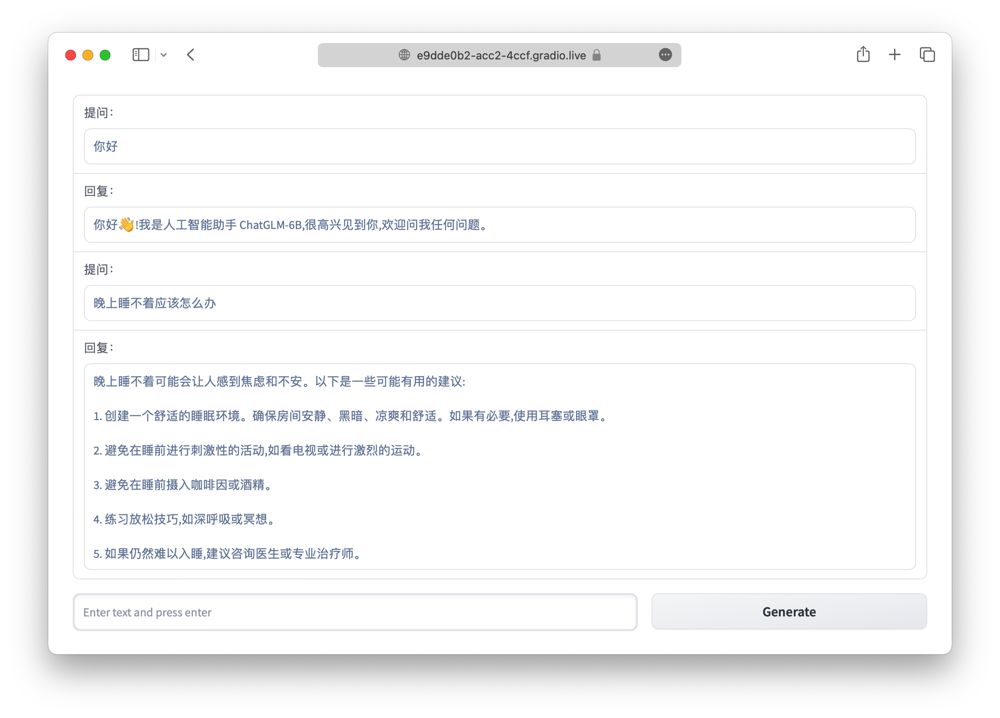

# ChatGLM-6B

## 介绍

ChatGLM-6B 是一个开源的、支持中英双语问答的对话语言模型，基于 [General Language Model (GLM)](https://github.com/THUDM/GLM) 架构，具有 62 亿参数。结合模型量化技术，用户可以在消费级的显卡上进行本地部署（INT4 量化级别下最低只需 6GB 显存）。ChatGLM-6B 使用了和 [ChatGLM](https://chatglm.cn) 相同的技术，针对中文问答和对话进行了优化。经过约 1T 标识符的中英双语训练，辅以监督微调、反馈自助、人类反馈强化学习等技术的加持，62 亿参数的 ChatGLM-6B 已经能生成相当符合人类偏好的回答。

## 硬件需求

| **量化等级**    | **最低 GPU 显存** |
| -------------- | ----------------- |
| FP16（无量化）   | 13 GB             |
| INT8           | 10 GB              |
| INT4           | 6 GB               |

## 使用方式

### 环境安装

使用 pip 安装依赖：`pip install -r requirements.txt`，其中 `transformers` 库版本推荐为 `4.26.1`，但理论上不低于 `4.23.1` 即可。

### 代码调用 

可以通过如下代码调用 ChatGLM-6B 模型来生成对话：

```python
>>> from transformers import AutoTokenizer, AutoModel
>>> tokenizer = AutoTokenizer.from_pretrained("THUDM/chatglm-6b", trust_remote_code=True)
>>> model = AutoModel.from_pretrained("THUDM/chatglm-6b", trust_remote_code=True).half().cuda()
>>> response, history = model.chat(tokenizer, "你好", history=[])
>>> print(response)
你好👋!我是人工智能助手 ChatGLM-6B,很高兴见到你,欢迎问我任何问题。
>>> response, history = model.chat(tokenizer, "晚上睡不着应该怎么办", history=history)
>>> print(response)
晚上睡不着可能会让你感到焦虑或不舒服,但以下是一些可以帮助你入睡的方法:

1. 制定规律的睡眠时间表:保持规律的睡眠时间表可以帮助你建立健康的睡眠习惯,使你更容易入睡。尽量在每天的相同时间上床,并在同一时间起床。
2. 创造一个舒适的睡眠环境:确保睡眠环境舒适,安静,黑暗且温度适宜。可以使用舒适的床上用品,并保持房间通风。
3. 放松身心:在睡前做些放松的活动,例如泡个热水澡,听些轻柔的音乐,阅读一些有趣的书籍等,有助于缓解紧张和焦虑,使你更容易入睡。
4. 避免饮用含有咖啡因的饮料:咖啡因是一种刺激性物质,会影响你的睡眠质量。尽量避免在睡前饮用含有咖啡因的饮料,例如咖啡,茶和可乐。
5. 避免在床上做与睡眠无关的事情:在床上做些与睡眠无关的事情,例如看电影,玩游戏或工作等,可能会干扰你的睡眠。
6. 尝试呼吸技巧:深呼吸是一种放松技巧,可以帮助你缓解紧张和焦虑,使你更容易入睡。试着慢慢吸气,保持几秒钟,然后缓慢呼气。

如果这些方法无法帮助你入睡,你可以考虑咨询医生或睡眠专家,寻求进一步的建议。
```
完整的模型实现可以在 [HuggingFace Hub](https://huggingface.co/THUDM/chatglm-6b) 上查看。

### Demo

我们提供了一个基于 [Gradio](https://gradio.app) 的网页版 Demo 和一个命令行 Demo。使用时首先需要下载本仓库：

```shell
git clone https://github.com/THUDM/ChatGLM-6B
cd ChatGLM-6B
```

#### 网页版 Demo



首先安装 Gradio：`pip install gradio`，然后运行仓库中的 [web_demo.py](web_demo.py)： 

```shell
python web_demo.py
```

程序会运行一个 Web Server，并输出地址。在浏览器中打开输出的地址即可使用。

#### 命令行 Demo


运行仓库中 [cli_demo.py](cli_demo.py)：

```shell
python cli_demo.py
```

程序会在命令行中进行交互式的对话，在命令行中输入指示并回车即可生成回复，输入`clear`可以清空对话历史，输入`stop`终止程序。

## 模型量化
默认情况下，模型以 FP16 精度加载，运行上述代码需要大概 13GB 显存。如果你的 GPU 显存有限，可以尝试以量化方式加载模型，使用方法如下：

```python
# 按需修改，目前只支持 4/8 bit 量化
model = AutoModel.from_pretrained("THUDM/chatglm-6b", trust_remote_code=True).half().quantize(4).cuda()
```

进行 2 至 3 轮对话后，8-bit 量化下 GPU 显存占用约为 10GB，4-bit 量化下仅需 6GB 占用。随着对话轮数的增多，对应消耗显存也随之增长，由于采用了相对位置编码，理论上 ChatGLM-6B 支持无限长的 context-length，但总长度超过 2048（训练长度）后性能会逐渐下降。

模型量化会带来一定的性能损失，经过测试，ChatGLM-6B 在 4-bit 量化下仍然能够进行自然流畅的生成，使用 [GPT-Q](https://arxiv.org/abs/2210.17323) 等量化方案可以进一步压缩量化精度/提升相同量化精度下的模型性能，我们期待开源社区为本项目提供对应 Pull Request。

## 协议

本仓库的代码依照 [Apache-2.0](LICENSE) 协议开源，ChatGLM-6B 模型的权重的使用则需要遵循 [Model License](MODEL_LICENSE)。

## 引用

如果你觉得我们的工作有帮助的话，请考虑引用下列论文

```
@inproceedings{
  zeng2023glm-130b,
  title={{GLM}-130B: An Open Bilingual Pre-trained Model},
  author={Aohan Zeng and Xiao Liu and Zhengxiao Du and Zihan Wang and Hanyu Lai and Ming Ding and Zhuoyi Yang and Yifan Xu and Wendi Zheng and Xiao Xia and Weng Lam Tam and Zixuan Ma and Yufei Xue and Jidong Zhai and Wenguang Chen and Zhiyuan Liu and Peng Zhang and Yuxiao Dong and Jie Tang},
  booktitle={The Eleventh International Conference on Learning Representations (ICLR)},
  year={2023},
  url={https://openreview.net/forum?id=-Aw0rrrPUF}
}
```
```
@inproceedings{du2022glm,
  title={GLM: General Language Model Pretraining with Autoregressive Blank Infilling},
  author={Du, Zhengxiao and Qian, Yujie and Liu, Xiao and Ding, Ming and Qiu, Jiezhong and Yang, Zhilin and Tang, Jie},
  booktitle={Proceedings of the 60th Annual Meeting of the Association for Computational Linguistics (Volume 1: Long Papers)},
  pages={320--335},
  year={2022}
}
```
